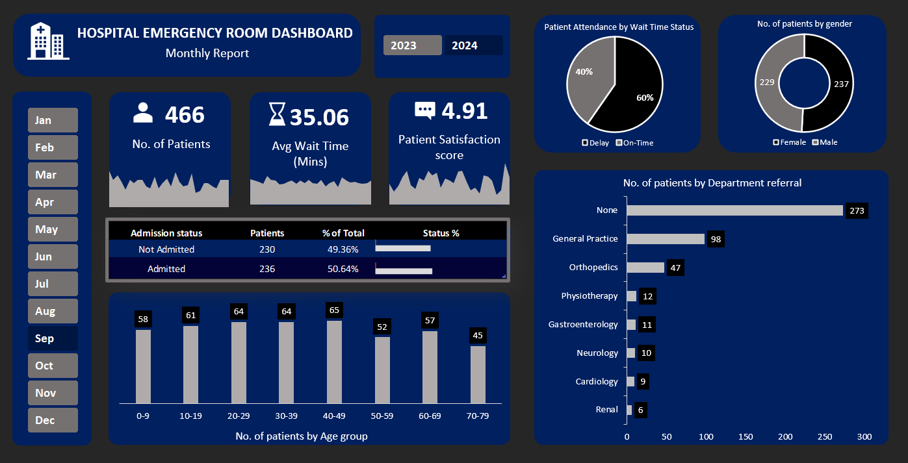

# hospital-emergency-room-dashboard-excel
This project showcases an interactive Hospital Emergency Room Dashboard built in Microsoft Excel.

<h2> Goal </h2>

The main goal of this project is to help hospital administrative staff and healthcare stakeholders monitor ER efficiency, analyze patient traffic patterns and uncover actionable insights. By tracking wait times and satisfaction scores, the hospital can make data-driven decisions to optimize staffing, reduce bottlenecks and ultimately improve patient care and satisfaction.

<h2> KPI requirements </h2>

  <ul>
    <li> Count the total number of patients visiting ER each day </li>
    
 Show a daily trend using an area chart to spot patterns like busy days or seasonal trends 

    <li> Average waiting time for patients to see a medical professional </li>
    
 Use an area chart to track daily changes and highlight days with longer wait times that might need improvements 

    <li> Average daily satisfaction score of patients </li>
    
 Identify trends and drop in satisfaction score using an area chart 

  </ul>

<h2>Steps involved: </h2>

  <ol>
   <li> Data Extraction from raw csv file to Excel</li>
    <li> Understanding the data and KPI requirements </li>
    <li> Data cleaning using Power Query </li>
    <li> Data modeling using Power Pivots </li>
    <li> Feature engineering by writing DAX formulas to segment raw data into operational groups</li>
    <li> Dashboard visualization by creating interactive pivot charts that work dynamically with slicers </li>
  </ol>

